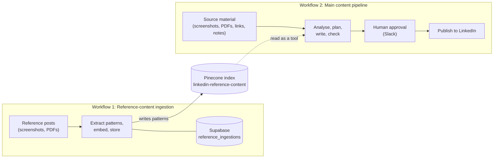
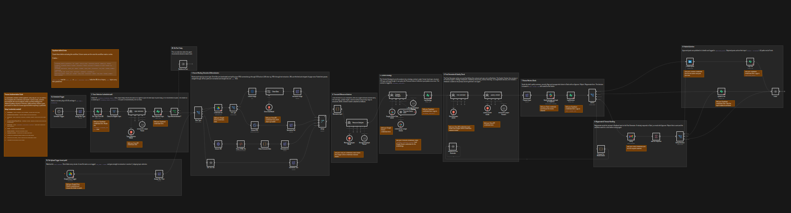

# Human-Approved LinkedIn Content Pipeline (n8n)

A two-workflow n8n system that learns writing patterns from strong LinkedIn posts, then turns raw source material (screenshots, PDFs, links and notes) into fact-checked LinkedIn drafts. A person approves every post before it goes live.

> **Status:** the reference-content ingestion workflow is complete and tested end-to-end. The main pipeline is fully built out as nodes; wiring, configuration and end-to-end testing on real data are still in progress. See [Status](#status).

For the full write-up (design decisions, AI node map, trade-offs), see the [case study](docs/linkedin-content-pipeline-case-study.pdf).

---

## Why this exists

Handing "write my LinkedIn post" to a single LLM prompt causes four problems: invented specifics, privacy leaks, generic output and loss of control. Each AI node in this system answers one of them, which is why it uses several narrow agents instead of one large prompt.

| Problem | How the system handles it |
|---|---|
| Invented specifics | Posts may only use facts extracted from the source, checked by an independent QA agent |
| Privacy leaks | The analyzer flags client names, unreleased information and credentials before anything is written |
| Generic output | A vector store of reference patterns (hooks, structures, tones, CTAs) guides how a post is written |
| Loss of control | Nothing publishes without an explicit human approval in Slack |

## How it works

The two workflows share one Pinecone index and nothing else. Ingestion writes reference **patterns** into it; the main pipeline's Content Strategist reads them as a retrieval tool. Facts never come from the index, only from the source material.



### Workflow 1: Reference-content ingestion



Watches a Google Drive folder for new reference posts and stores their reusable patterns.

1. **Trigger and duplicate check.** A Drive trigger polls the folder every minute. A Supabase lookup on the Drive file ID skips files that were already ingested.
2. **Extraction.** PDFs go through text extraction. JPEG screenshots go through Tesseract OCR, then an LLM clean-up pass (Groq `gpt-oss-20b`) that repairs OCR artifacts and strips like and comment counts.
3. **Pattern extraction.** An agent (Gemini) returns strict JSON: `hook_type`, `structure`, `tone`, `formatting_notes`, `cta_type`, `anti_patterns`. The prompt forbids repeating the post's own facts, names or numbers.
4. **Embed, store, log.** The pattern fields are chunked, embedded with Gemini embeddings and inserted into Pinecone with `source_file_id`, `ingested_at` and `hook_type` metadata. A row is written to Supabase last, so a failed run is never recorded as done.

### Workflow 2: Main content pipeline

Two entry points: a **scheduled path** (daily at 10:00, picks a topic from a Supabase inventory) and an **event path** (a file lands in a watched Drive folder and skips topic selection).

| Stage | What happens | AI? |
|---|---|---|
| 1. Triggers | Schedule and Google Drive trigger | No |
| 2. Topic selection | Agent picks the best eligible topic, or recommends no post today | Yes |
| 3. Extraction | Screenshot, PDF, URL and pasted text converge on one text field, capped at 6,000 characters | OCR clean-up only |
| 4. Resource analysis | Extracts only explicitly stated facts, angles and privacy flags | Yes |
| 5. Content strategy | Chooses angle, format, hook, structure, CTA and length, using reference patterns from Pinecone | Yes |
| 6. Generation and QA | Post Generator writes the draft; Quality Checker verifies facts, strategy compliance, readability and privacy, and never rewrites | Yes |
| 7. Human review | Slack message with Approve, Reject or Regenerate plus a feedback field | No |
| 8. Routing | Deterministic Switch nodes: publish, archive, regenerate with feedback, or email reminder with one-click links | No |
| 9. Publish and log | Post and its strategy fields are written to Supabase | No |

## Design principles

- **Grounded.** Claims must trace back to facts extracted from the source.
- **Patterns, not facts, from RAG.** Retrieval shapes structure and tone; it never injects claims.
- **Human final say.** No approval, no post.
- **Auditable.** Every stage leaves a record in Supabase.
- **Resilient.** Gemini fallback models on the two critical agents, and reminders when a reviewer does not respond.
- **Format-agnostic.** Screenshots, PDFs, web pages and pasted text feed one pipeline.
- **AI where judgement is needed, rules everywhere else.** Routing, logging and publishing stay deterministic.

## Tech stack

| Layer | Tools |
|---|---|
| Orchestration | [n8n](https://n8n.io) |
| Models | Groq-hosted `gpt-oss-120b` and `gpt-oss-20b`; Google Gemini for pattern extraction, strategy, fallbacks and embeddings |
| OCR | Tesseract |
| Vector store | Pinecone |
| Database | Supabase (Postgres) |
| Integrations | Google Drive, Slack, Gmail, LinkedIn |

## Getting started

Set up and test **Workflow 1 first**, because the main pipeline reads the index it fills.

### Prerequisites

- An n8n instance (self-hosted or cloud) with the Tesseract community node available
- Accounts and API credentials for: Google Drive (OAuth), Supabase, Groq, Google Gemini, Pinecone
- For the main pipeline: Slack, Gmail and LinkedIn credentials

### 1. Create the Supabase table for ingestion

Run once in the Supabase SQL editor:

```sql
create table reference_ingestions (
  id uuid primary key default gen_random_uuid(),
  source_file_id text not null,
  file_name text,
  ingested_at timestamptz not null default now()
);

create index idx_reference_ingestions_source_file_id
  on reference_ingestions(source_file_id);
```

### 2. Create the Pinecone index

Create an index named `linkedin-reference-content`. Its dimension must match the Gemini embedding model you use.

> Use the **same embedding model** in both workflows. Query vectors are only comparable to stored vectors from the same model, so mixing models makes similarity scores meaningless.

### 3. Import and configure Workflow 1

1. In n8n, import `workflows/content-ingestion.json`.
2. Attach credentials to the Google Drive trigger and download nodes, the Supabase nodes, both chat models, the Gemini embeddings node and the Pinecone node.
3. Set the Drive trigger to your reference-content folder.
4. Activate the workflow and drop a reference screenshot or PDF into the folder.
5. Confirm a new row in `reference_ingestions` and a new vector in Pinecone.

### 4. Import and configure Workflow 2


1. Import `workflows/main-content-pipeline.json`.
2. Attach credentials to every model, Pinecone, Supabase, Slack, Gmail and LinkedIn node.
3. Set the Drive trigger to your post-content folder and point the Slack and email nodes at your reviewer.
4. Create the Supabase objects the pipeline reads and writes: the topic inventory and its `eligible_trending_topics` view, plus the `strategy_contracts`, `post_review_log` and `published_posts` tables.
5. Point the strategist's Pinecone tool at `linkedin-reference-content`.

## Repository structure

```
.
├── README.md
├── docs/
│   └── linkedin-content-pipeline-case-study.pdf
└── workflows/
    ├── content-ingestion.json
    └── main-content-pipeline.json
```

## Status

| Area | Status |
|---|---|
| Reference-content ingestion | Complete, tested end-to-end |
| Main pipeline | Every stage from topic selection to publish and logging exists as nodes, including all AI nodes |
| Topic inventory and eligibility view | Designed; needs to be created and populated with real rows |
| Duplicate-topic check | Designed as a reselection loop capped at three attempts, checking against a published-posts vector index; index still to be built and loop tested |
| Cooldown reset | Decided: the publish step will record `last_posted_at`; not yet implemented |
| LinkedIn publishing step | Node in place; author and post-text configuration remaining |
| End-to-end run on real data | Pending |

No production numbers are claimed. Once the pipeline runs on real topics, success can be measured from its own logs: approval, rejection and regeneration rates, unsupported-claim and privacy flags per draft, which hooks, structures and CTAs get approved, and time from source material to approved draft.


